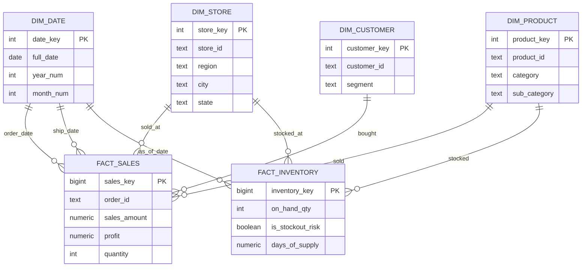

# Entity relationship (star schema)

```mermaid
erDiagram
    DIM_DATE ||--o{ FACT_SALES : order_date
    DIM_DATE ||--o{ FACT_SALES : ship_date
    DIM_DATE ||--o{ FACT_INVENTORY : as_of_date
    DIM_STORE ||--o{ FACT_SALES : sold_at
    DIM_STORE ||--o{ FACT_INVENTORY : stocked_at
    DIM_PRODUCT ||--o{ FACT_SALES : sold
    DIM_PRODUCT ||--o{ FACT_INVENTORY : stocked
    DIM_CUSTOMER ||--o{ FACT_SALES : bought

    DIM_DATE {
        int date_key PK
        date full_date
        int year_num
        int month_num
    }
    DIM_STORE {
        int store_key PK
        text store_id
        text region
        text city
        text state
    }
    DIM_PRODUCT {
        int product_key PK
        text product_id
        text category
        text sub_category
    }
    DIM_CUSTOMER {
        int customer_key PK
        text customer_id
        text segment
    }
    FACT_SALES {
        bigint sales_key PK
        text order_id
        numeric sales_amount
        numeric profit
        int quantity
    }
    FACT_INVENTORY {
        bigint inventory_key PK
        int on_hand_qty
        boolean is_stockout_risk
        numeric days_of_supply
    }
```

Connect Power BI / Tableau to the **views** in `sql/views.sql` for most visuals; use base facts when you need row-level detail.
